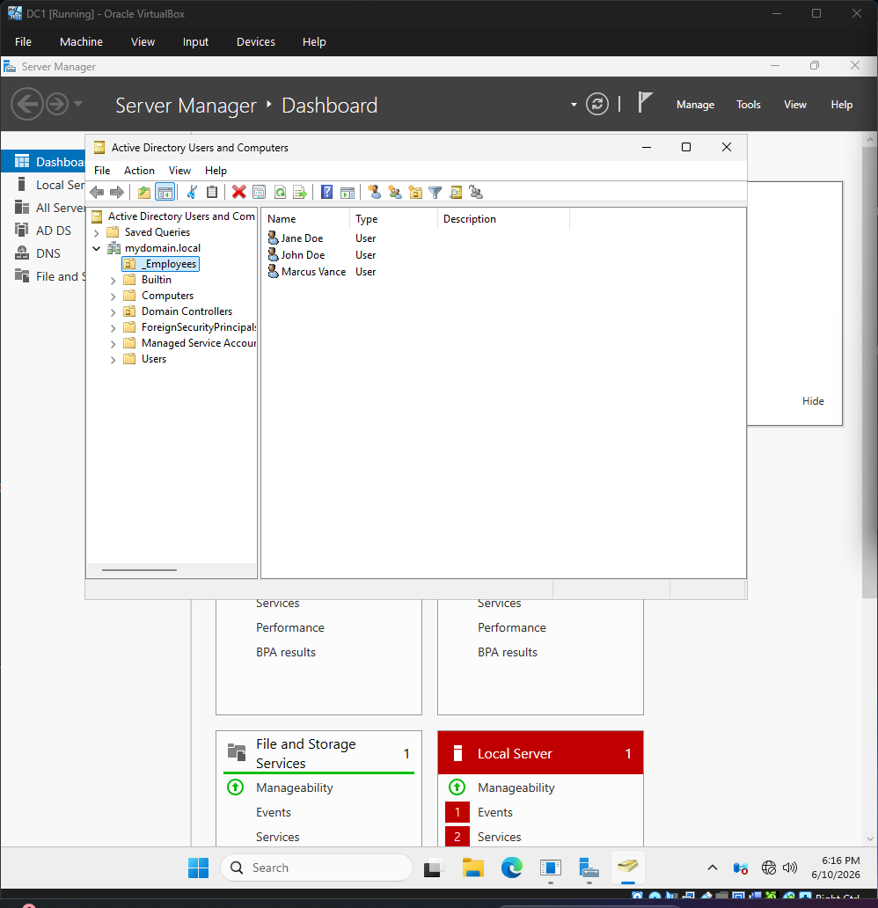
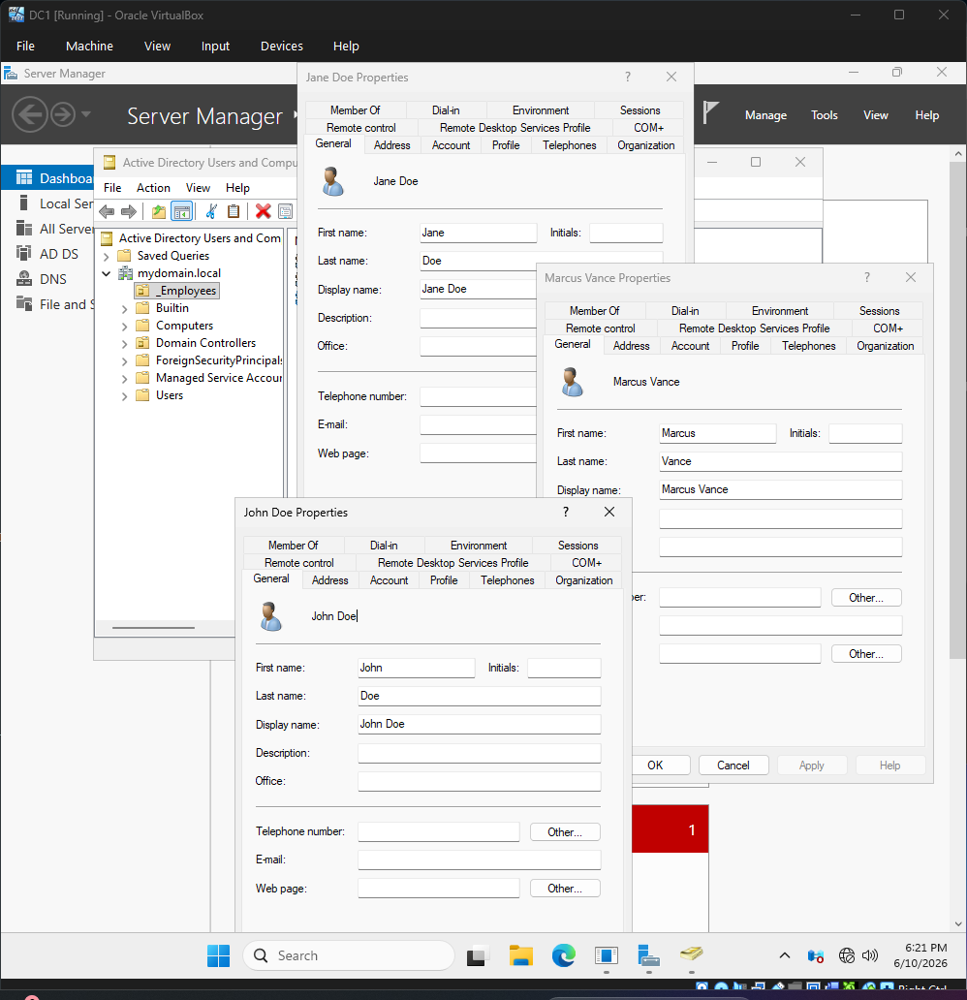
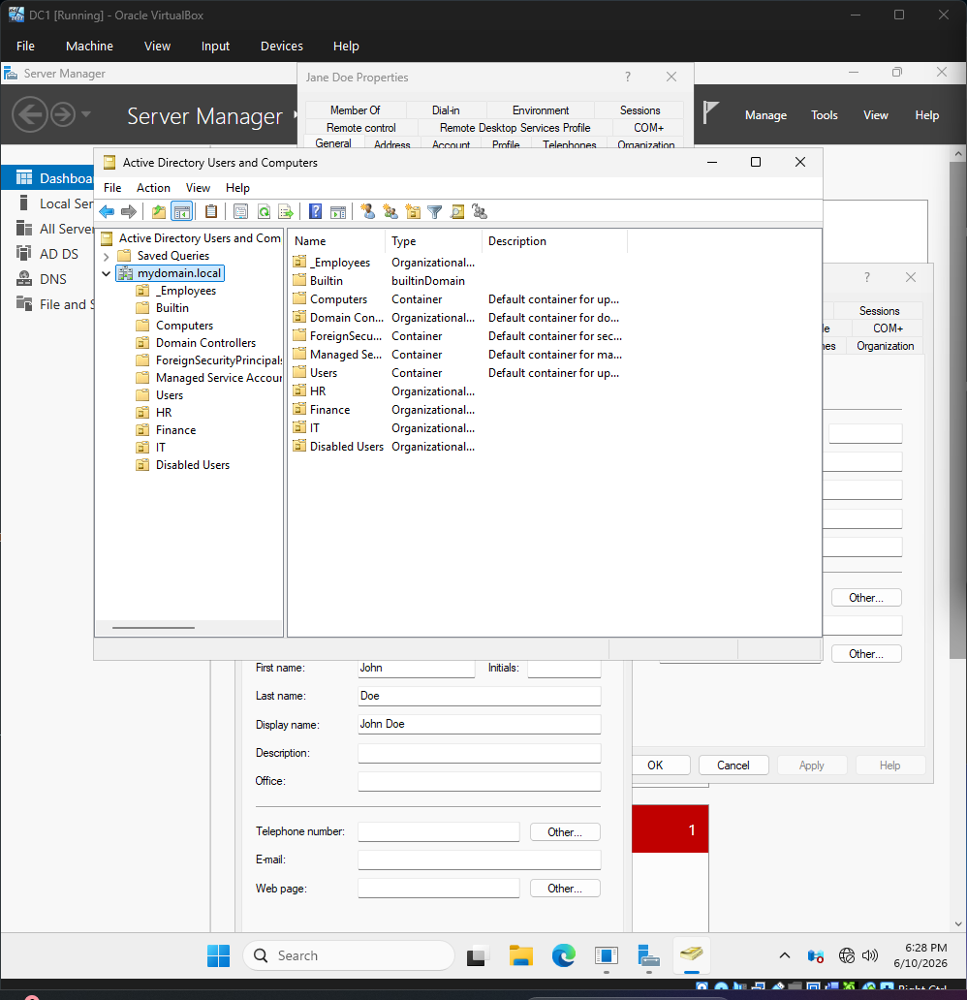
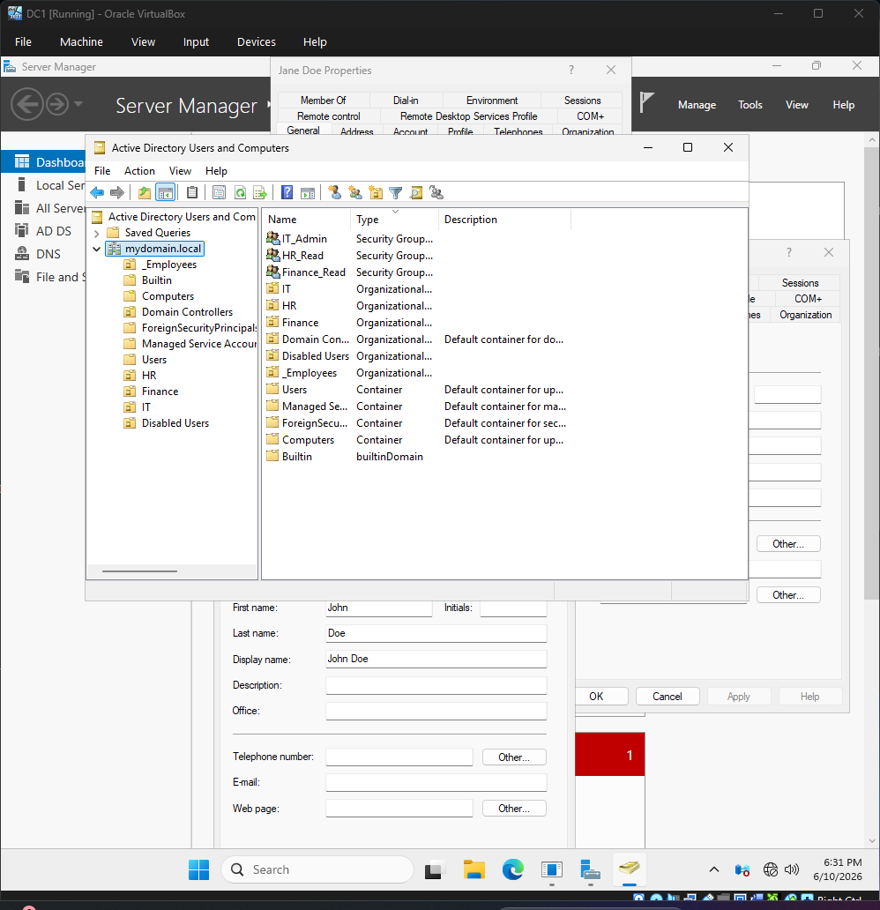
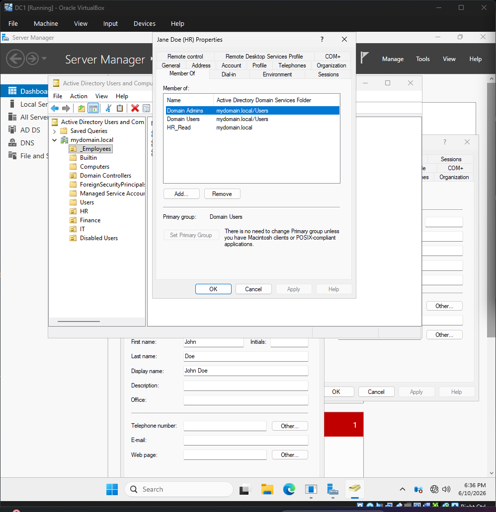
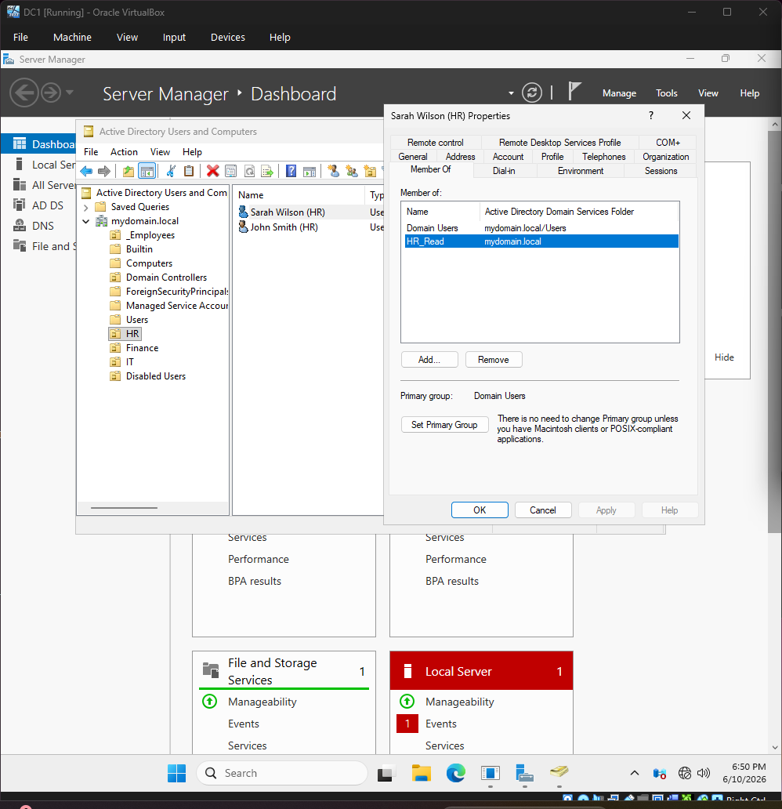
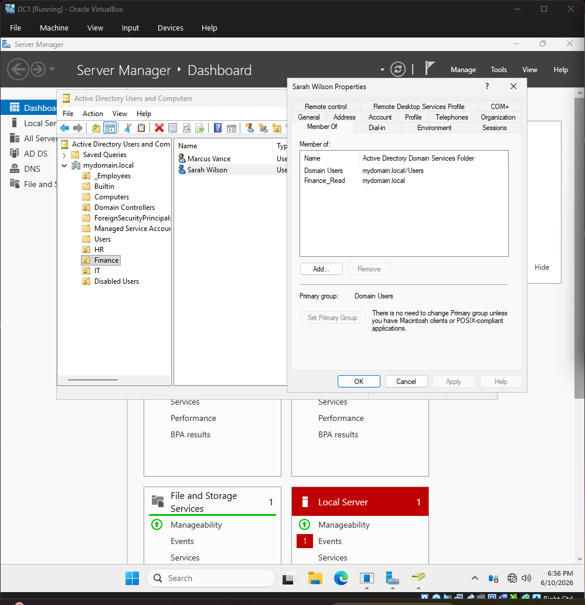
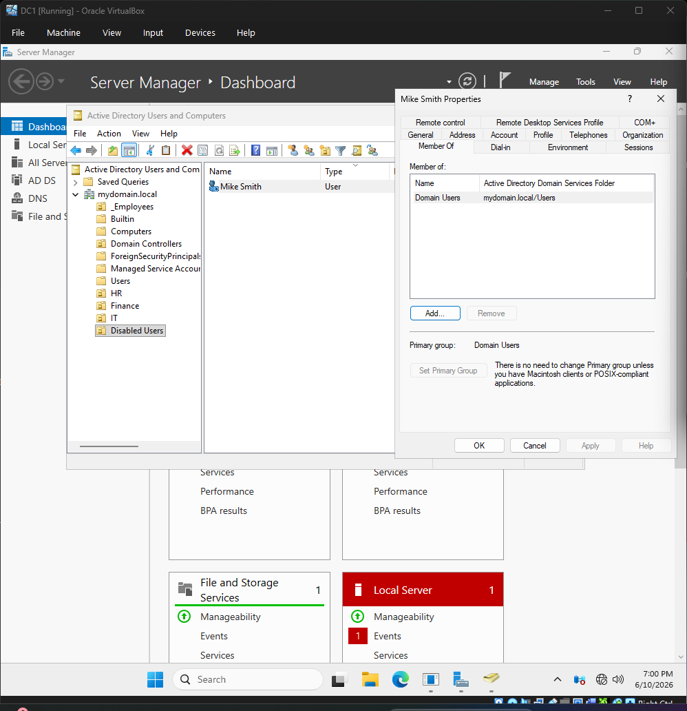

# 📘 Identity & Access Management (IAM) Active Directory Lifecycle Lab

---

## 🧠 Overview

This project simulates enterprise Identity and Access Management (IAM) operations using a Windows Server Active Directory environment. It demonstrates end-to-end identity lifecycle management, including user provisioning, role-based access control (RBAC), department transfers, and account deprovisioning.

The goal of this lab is to replicate real-world IAM workflows used in enterprise IT environments to manage digital identities securely and efficiently.

---

## 🎯 Objectives

- Simulate real-world IAM workflows in Active Directory  
- Implement Role-Based Access Control (RBAC)  
- Demonstrate identity lifecycle management (Joiner–Mover–Leaver model)  
- Apply least-privilege access principles  
- Practice enterprise-style user provisioning and deprovisioning  

---

## 🏗️ Environment

- **Domain Controller:** Windows Server with Active Directory Domain Services (AD DS)  
- **Domain Name:** mydomain.local  
- **Client Machine:** Windows 10/11 domain-joined workstation  
- **Virtualization Platform:** VirtualBox  
- **Core Technology:** Active Directory (AD DS)  

---

## 🔐 IAM Concepts Demonstrated

- Identity Lifecycle Management  
- User Provisioning (Joiner process)  
- Role-Based Access Control (RBAC)  
- Organizational Unit (OU) Design  
- Security Group Management  
- Least Privilege Access Control  
- Department Transfers (Mover process)  
- Account Deprovisioning (Leaver process)  

---

## 🧩 Active Directory Structure

- HR OU  
- Finance OU  
- IT OU  
- Disabled Users OU  

Security Groups:
- HR_Read  
- Finance_Read  
- IT_Admin  

---

## 🔄 IAM Lifecycle Workflow

### 1. Provisioning (Joiner)
A new user account is created, placed in the correct department OU, and assigned role-based access via security groups.

### 2. Access Control (RBAC)
Users are granted access based on group membership rather than individual permissions, enforcing least-privilege principles.

### 3. Role Change (Mover)
Users are moved between departments, with old permissions removed and new permissions assigned to reflect their updated role.

### 4. Deprovisioning (Leaver)
User accounts are disabled, removed from security groups, and moved to a restricted OU to revoke all access.

---

## 🔐 Real-World IAM Mapping

This lab maps directly to enterprise IAM operations:

- Active Directory → Identity Store  
- Security Groups → Role-Based Access Control (RBAC)  
- OUs → Organizational Identity Segmentation  
- User Lifecycle → Joiner / Mover / Leaver process  

---

# 📸 Lab Evidence (Screenshots)

---

## ## 01 – Active Directory Overview
Initial review of the domain structure in mydomain.local prior to implementing IAM workflows.

---

## ## 02 – User Identity Audit
Review of existing user accounts to assess identity state before structuring access control.

---

## ## 03 – Organizational Units (OU Structure)
Creation of departmental OUs (HR, Finance, IT, Disabled Users) to organize identity management.

---

## ## 04 – Security Groups (RBAC Implementation)
Creation of role-based security groups to manage access through group membership.

---

## ## 05 – User Group Assignment
Assignment of users to security groups to enforce RBAC and least-privilege access control.

---

## ## 06 – New Hire Onboarding
Provisioning of a new user account (Sarah Wilson), assignment to HR OU, and HR_Read access.

---

## ## 07 – Department Transfer
User role change from HR to Finance with updated group membership and removal of legacy access.

---

## ## 08 – User Termination
Account deactivation, removal of group memberships, and relocation to Disabled Users OU.

